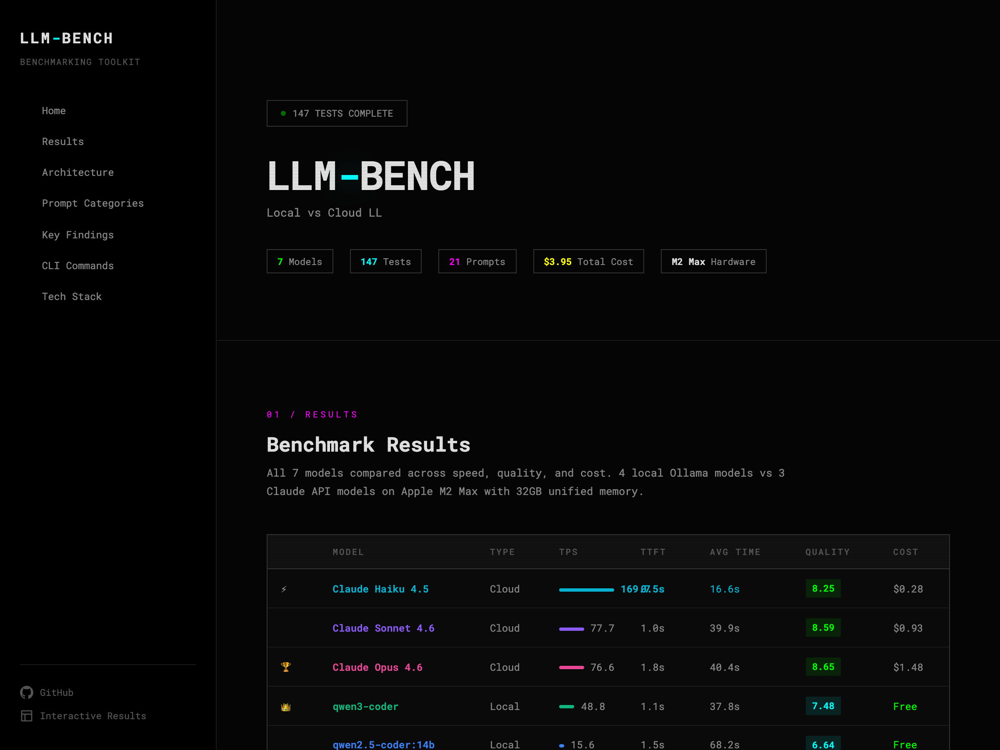

# LLM-BENCH

**Local vs Cloud LLM Benchmarking Toolkit**


Benchmark local Ollama models against Claude API on Apple Silicon. Measures speed (tokens/sec, TTFT), quality (scored by Claude Sonnet), and cost across 21 coding prompts in 7 categories.

**[View the live site](https://parsamivehchi.github.io/LLM-BENCH/)** · **[Interactive Results](https://parsamivehchi.github.io/LLM-BENCH/../comparison/)** · **[Hardware Guide](https://parsamivehchi.github.io/LLM-BENCH/../comparison/hardware.html)**

<p align="center">
  <a href="https://parsamivehchi.github.io/LLM-BENCH/">
    
  </a>
</p>

## Results

| Model | Type | TPS | TTFT | Avg Time | Quality | Cost |
|-------|------|----:|-----:|---------:|--------:|-----:|
| Claude Haiku 4.5 | Cloud | **169.7** | **0.5s** | **16.6s** | 8.25/10 | $0.28 |
| Claude Sonnet 4.6 | Cloud | 77.7 | 1.0s | 39.9s | 8.59/10 | $0.93 |
| Claude Opus 4.6 | Cloud | 76.6 | 1.8s | 40.4s | **8.65/10** | $1.48 |
| qwen3-coder (30B MoE) | Local | 48.8 | 1.1s | 37.8s | 7.48/10 | Free |
| qwen2.5-coder:14b | Local | 15.6 | 1.5s | 68.2s | 6.64/10 | Free |
| deepseek-r1:14b | Local | 14.6 | 70.2s | 137.0s | 5.89/10 | Free |
| glm-4.7-flash (~9B) | Local | 10.2 | 54.8s | 229.5s | 5.30/10 | Free |

## Quick Start

```bash
# Clone
git clone https://github.com/parsamivehchi/LLM-BENCH.git
cd LLM-BENCH

# Install dependencies
python -m venv .venv
source .venv/bin/activate
pip install -r requirements.txt

# Configure API key (for cloud models)
echo "ANTHROPIC_API_KEY=sk-ant-..." > .env

# Start Ollama (for local models)
ollama serve

# Run benchmarks
python -m llm_bench run

# Score outputs
python -m llm_bench judge <run_id>

# Generate reports
python -m llm_bench report <run_id>
```

## Architecture

```
                    ┌─────────────────┐
                    │   Prompt Bank    │
                    │  21 YAML prompts │
                    │  7 categories    │
                    └────────┬────────┘
                             │
                    ┌────────▼────────┐
                    │     Runner      │
              ┌─────┤  Execute against├─────┐
              │     │   all models    │     │
              │     └─────────────────┘     │
      ┌───────▼───────┐           ┌────────▼────────┐
      │    Ollama      │           │  Anthropic API   │
      │  (4 local)     │           │  (3 cloud)       │
      └───────┬───────┘           └────────┬────────┘
              │     ┌─────────────────┐     │
              └─────►     Judge       ◄─────┘
                    │ Claude Sonnet   │
                    │ Quality Scoring │
                    └────────┬────────┘
                             │
              ┌──────────────┼──────────────┐
              │              │              │
      ┌───────▼──────┐ ┌────▼─────┐ ┌─────▼──────┐
      │   Reports    │ │Dashboard │ │  Website   │
      │ .docx .pptx  │ │  React   │ │ Chart.js   │
      └──────────────┘ └──────────┘ └────────────┘
```

### Modules

| Module | Path | Purpose |
|--------|------|---------|
| CLI | `llm_bench/cli.py` | Typer CLI with 8 commands |
| Config | `llm_bench/config.py` | Model definitions, categories, constants |
| Prompts | `llm_bench/prompts/` | YAML prompt bank loader |
| Models | `llm_bench/models/` | Ollama + Anthropic adapters |
| Runner | `llm_bench/runner/` | Benchmark executor with metrics |
| Judge | `llm_bench/judge/` | Claude-based quality scoring |
| Analysis | `llm_bench/analysis/` | Rankings and statistical analysis |
| Reports | `llm_bench/reports/` | Word, PPTX, hardware report generators |
| Export | `llm_bench/export/` | Dashboard JSON export |
| Hardware | `llm_bench/hardware/` | GPU/thermal/power monitoring |

## CLI Commands

```bash
# Run benchmarks
python -m llm_bench run                              # All models, all categories
python -m llm_bench run -m qwen3-coder               # Single model
python -m llm_bench run -c code_generation            # Single category
python -m llm_bench run --hardware-metrics            # With GPU/thermal capture
python -m llm_bench run --no-cache                    # Skip cached cloud results

# Post-processing
python -m llm_bench judge <run_id>                    # Quality scoring via Claude Sonnet
python -m llm_bench analyze <run_id>                  # Generate analysis + rankings
python -m llm_bench report <run_id>                   # Word + PowerPoint reports
python -m llm_bench export <run_id>                   # Dashboard-ready JSON

# Utilities
python -m llm_bench hardware-report                   # Hardware infrastructure guide
python -m llm_bench cost-estimate                     # Estimate cost for a full run
python -m llm_bench list-runs                         # List all benchmark runs
```

## Prompt Categories

| Category | File | Description |
|----------|------|-------------|
| Code Generation | `code_generation.yaml` | Write new code from specifications |
| Debugging & Reasoning | `debugging_reasoning.yaml` | Find and fix bugs, trace logic |
| Refactoring | `refactoring.yaml` | Improve existing code structure |
| Explanation & Teaching | `explanation_teaching.yaml` | Explain concepts clearly |
| Short Quick Tasks | `short_quick.yaml` | Fast utility operations |
| Long Complex Research | `long_complex.yaml` | Deep architecture and research tasks |
| Tool Calling / Agentic | `tool_calling.yaml` | Agentic tool use patterns |

3 prompts per category = 21 total. Each model runs all 21 = 147 tests.

## Key Findings

- **Cloud wins on quality** — All Claude models score 8.25+. Opus (8.65) barely edges Sonnet (8.59), making Sonnet the smart buy at 63% the cost.
- **Haiku is the speed king** — 169.7 tok/s, 3.5x faster than qwen3-coder, with near-Opus quality (8.25 vs 8.65) at 19% the cost.
- **MoE dominates local** — qwen3-coder (30B MoE) runs 3.1x faster than qwen2.5-coder (14B dense) despite being 2x the parameters. MoE activates fewer params per token.
- **Bias caveat** — 62/147 scores involve Claude judging Claude. Flagged in all reports but may inflate cloud scores.
- **Total cost: $3.95** — Cloud run $2.69 + quality judging $1.26. Local models cost nothing.

## Generated Reports

| File | Type | Content |
|------|------|---------|
| `reports/llm_bench_report_combined_full.docx` | Word | Full 7-model benchmark report |
| `reports/llm_bench_presentation_combined_full.pptx` | PPTX | Presentation with charts |
| `reports/model_comparison_20260226.pptx` | PPTX | 11-slide comparison deck |
| `reports/on_premise_llm_guide.docx` | Word | Hardware infrastructure guide |
| `reports/on_premise_llm_infrastructure.pptx` | PPTX | Hardware infrastructure deck |
| `comparison/index.html` | Web | Interactive benchmark comparison |
| `comparison/hardware.html` | Web | Hardware comparison + calculators |
| `dashboard/dist/` | React | Full dashboard with Recharts |

## Project Structure

```
LLM-BENCH/
├── llm_bench/               # Python package
│   ├── cli.py               # Typer CLI (8 commands)
│   ├── config.py             # Models, categories, constants
│   ├── models/               # Ollama + Anthropic adapters
│   ├── prompts/bank/         # 7 YAML prompt files (21 prompts)
│   ├── runner/               # Benchmark executor + metrics
│   ├── judge/                # Quality scoring via Claude Sonnet
│   ├── analysis/             # Rankings + statistical analysis
│   ├── reports/              # Word, PPTX, hardware report generators
│   ├── export/               # Dashboard JSON export
│   └── hardware/             # GPU/thermal/power monitoring
├── dashboard/                # React + Vite + Recharts dashboard
├── comparison/               # Interactive comparison website (Chart.js)
│   ├── index.html            # Benchmark results (Phase 1)
│   └── hardware.html         # Hardware guide (Phase 2)
├── data/
│   ├── results/              # Raw benchmark results per run
│   ├── scored/               # Quality-scored results
│   └── exports/              # Dashboard JSON exports
├── reports/                  # Generated .docx and .pptx files
├── docs/                     # GitHub Pages site
└── .env                      # Anthropic API key (not committed)
```

## Requirements

- Python 3.12+
- [Ollama](https://ollama.com) (for local models)
- Anthropic API key (for cloud models)
- Apple Silicon recommended (M2 Max 32GB used for benchmarks)
- Node.js / Bun (optional, for dashboard build)

## Quality Scoring

Each output is scored by Claude Sonnet 4.6 on three weighted criteria:

| Criterion | Weight | Description |
|-----------|--------|-------------|
| Correctness | 40% | Does the code work? Is it logically sound? |
| Completeness | 35% | Does it fully address the prompt? |
| Clarity | 25% | Is it well-structured and readable? |

Scores where Claude judges its own outputs are flagged for potential bias.

## Related

**[LLM-Setup-Kit-for-Mac](https://github.com/parsamivehchi/LLM-Setup-Kit-for-Mac)** — The dev environment this was built on. Full macOS migration kit with Brewfile, Ollama, Ghostty, Starship, and 17-phase automated setup.
